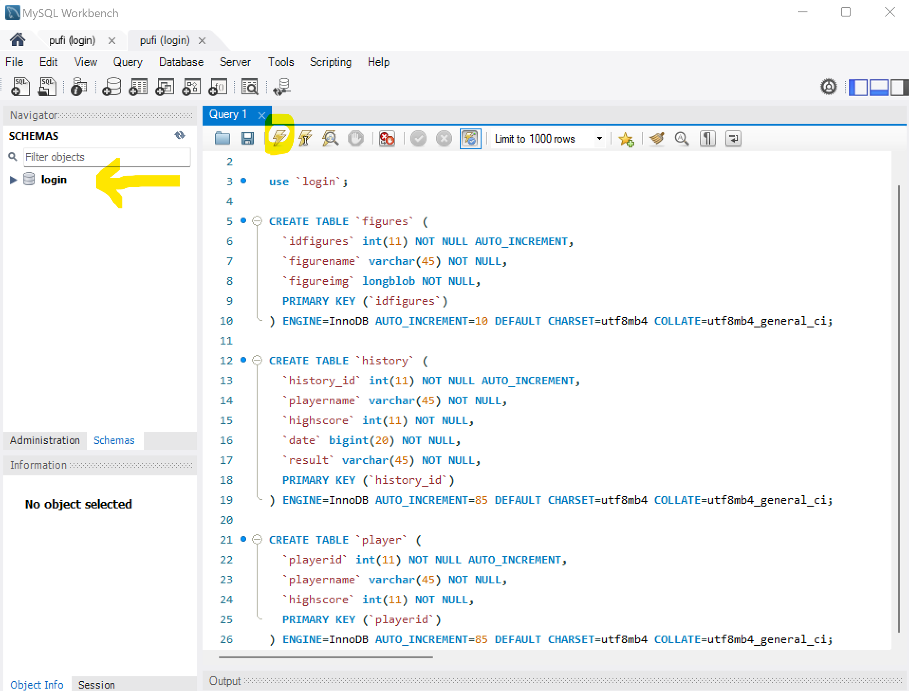

_**Um die Bilder der README angezeigt zu bekommen, müsst Ihr diese in euerer IDE öffnen!**_

# RuF-ighter Voreinstellungen
Guideline zum erfolgreichen Einrichten vom PuF Projekt PuF-ighter

## Content
- PuFAPI installieren
- MySQL Datenbankanbindung + Datenbankinhalt erstellen
- Datenbankinformationen in der _config_ anpassen


Um das Spiel erfolgreich zum Laufen zu bringen ist es notwendig eine sichere Datenbankverbindung zu einer lokalen Datenbank aufzubauen. Dazu müsst Ihr zuallererst den Server heruntergeladen und anpassen. Nach erfolgreicher Anpassung des Servers an die lokale Datenbank sollte sichergestellt werden, dass im Hauptprogramm (PuF-ighter) die Maven dependencies richtig laufen. Dazu solltet Ihr vor dem ersten Starten des Spieles Maven reloaden. 

### PuFApi 
Dieser Link bringt euch zu dem Github repository wo ihr die API für PuF-ighters herunterladen könnt. [Github Repo PuFAPI](https://github.com/Nakato-Illi/PufAPI).
Ladet sie runter und speichert sie gerne im selben Folder wie das Spiel. 

### MySQl Datenbankverbindung + Datenbankinhalt erstellen
Falls ihr MySQL noch nicht installiert habt ist hier ein Link zum Download. [Download MySQL Community](https://dev.mysql.com/downloads/mysql/)
1. legt ein neues Projekt an 
2. Gebt diesen Code ein, um die benötigte Datenbank mit den Tabellen anzulegen.
```
CREATE DATABASE `login`;

use `login`;

CREATE TABLE `figures` (
`idfigures` int(11) NOT NULL AUTO_INCREMENT,
`figurename` varchar(45) NOT NULL,
`figureimg` longblob NOT NULL,
PRIMARY KEY (`idfigures`)
) ENGINE=InnoDB AUTO_INCREMENT=10 DEFAULT CHARSET=utf8mb4 COLLATE=utf8mb4_general_ci;

CREATE TABLE `history` (
`history_id` int(11) NOT NULL AUTO_INCREMENT,
`playername` varchar(45) NOT NULL,
`highscore` int(11) NOT NULL,
`date` bigint(20) NOT NULL,
`result` varchar(45) NOT NULL,
PRIMARY KEY (`history_id`)
) ENGINE=InnoDB AUTO_INCREMENT=85 DEFAULT CHARSET=utf8mb4 COLLATE=utf8mb4_general_ci;

CREATE TABLE `player` (
`playerid` int(11) NOT NULL AUTO_INCREMENT,
`playername` varchar(45) NOT NULL,
`highscore` int(11) NOT NULL,
PRIMARY KEY (`playerid`)
) ENGINE=InnoDB AUTO_INCREMENT=85 DEFAULT CHARSET=utf8mb4 COLLATE=utf8mb4_general_ci;
```
Danach wird der Code einmal ausgeführt. .
3. ruft nun die Table **figures** auf mit dem Befehl: **"select * from figures;** ". Klickt dann mit rechtsklick auf die Column, figureimg und wählt _Load Value from File..._. Hier gibt ihr den Pfad zu den Bildern in dem Ordner /ReadMeImg/DatabaseImg/....png ein. Es sollten neun Bilder sein. Diese ladet Ihr in der entsprechenden Reihenfolge herunter. 

### Datenbankverbindung in der config anpassen. PuFApi
Die Config befindet sich in dem Folder Models. Dort müsste ihr die Parameter an eure Datenbank und umgebung anpassen.
Danach könnte ihr die PuFApi starten!


